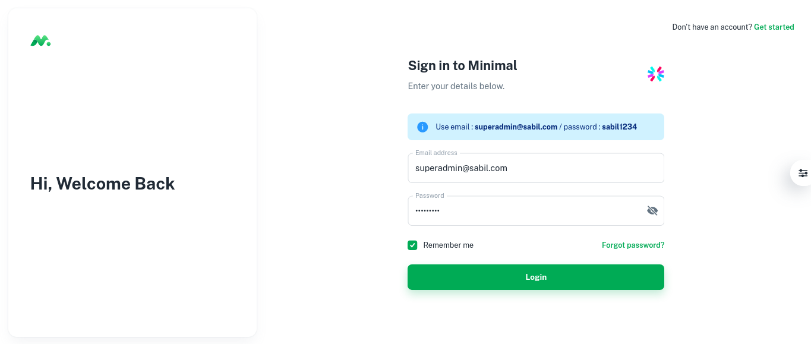
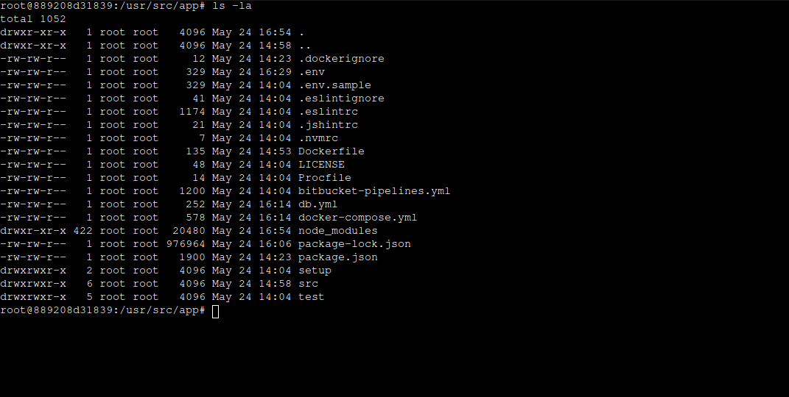
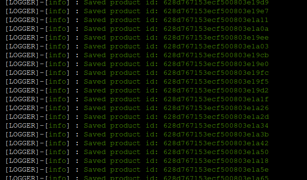

# Welcome to the Mern-Stack Project
#### This is a full-functional (Work in progress now)  ecommerce web application that is developed by using MERN (MongoDB, Express.js, React.js, and Node.js).

## Features:
1. In this repository I will keep adding the best practices we should follow in a MERN project. Also for better UX I am using MUI for the UI.
2. It can be run in two ways. One is using Docker, another way is to run manually.
3. Dynamically control the access of any component or API for any user or role via the admin control panel.
4. I will keep adding the best practices we should follow in a MERN project. Also for better UX I am using MUI for the UI.

Below are the sample of a product-shop and list page:


## Technology stack

This repository is built on top of Express.js and React.js, however in the implementation detail, we will find other supporting technologies as well.

#### Client side

- React - A JavaScript library for building user interfaces
- Material-UI Design - A design system for enterprise-level products. Create an efficient and enjoyable work experience
- Testing Library - React Testing Library (Not done yet)

#### Server side

- Node.js - evented I/O for the backend
- Express.js - Fast, unopinionated, minimalist web framework for Node.js
- MongoDB - The application data platform for NoSQL databases
- Mongoose - mongoose
- Swagger - Swagger (Not done yet)
- Jest - JavaScript testing framework (Not done yet)
- Super Test - Super test API testing framework (Not done yet)

Details frameworks and packages can be found in the package.json files in server and client directory.

## Running the application

This project can be run basically in two ways. One is using docker, other way is to run manually via vscode.

### Docker

Depending on the MongoDB hosting option, we choose the appropriate docker-compose file.

#### Docker compose files

Currently we have two docker-compose files:

- `docker-compose.mongocloud.yml` - MongoDB.com hosted cluster
- `docker-compose.yml` - Local MongoDB container

##### Notes

1. We need to change the `MONGODB_CLOUD_URL` in `docker-compose.mongocloud.yml` to the appropriate MongoDB URL.
2. We need to change the `REACT_APP_API_URL` in `docker-compose.yml` to the appropriate API URL. If we want to expose our client to the internet, we need to change the `REACT_APP_API_URL` to the appropriate API URL. Otherwise keep `REACT_APP_API_URL` as `http://localhost:8008`.

**Run docker-compose commands**

It is expected that the machine must have docker and docker-compose installed. Go to the root of the repository and execute appropriate commands. This will spin up the server and client containers along with the MongoDB container (if we are using local MongoDB server) inside of Docker environment.


**Using docker containers with cloud hosted MongoDB**

```sh
> cd project-root
> docker-compose -f docker-compose.mongocloud.yml build
> docker-compose -f docker-compose.mongocloud.yml up
```

**Using docker containers with local MongoDB**
```sh
> cd project-root
> docker-compose build
> docker-compose up
```

The client and server both are up and running and we should see the following screen if we navigate to the client url.




- seed data
  Go inside of the docker container and execute below commands. These will seed the database with `roles`, `users` and `products` data.

  ```sh
  docker exec -it appserver bash
  npm run db:seed
  npm run db:migrate
  ```

  You should see the following output:
  

  

  

  You should be now login to the application and see the products list.

### Visual Studio Code

#### Prerequisites

- Node.js : To run npm packages
- MongoDB : As a database for the application

##### Steps

- To run via vscode, we should run the server and client side projects separately, and also make sure mongodb is up and running.
- Create a `.env` file inside of the `server` directory. Add the below entries or change accordingly. You can follow the `.env.sample` file to see the format.

  ```
  DB_HOST=localhost
  DB_PORT=27017
  DB_NAME=sabil
  JWT_SECRET=secret
  JWT_EXPIRES_IN=3600
  PORT=8008
  IS_MONGODB_CLOUD_URL=false
  MONGODB_CLOUD_URL=mongodb+srv:// <USER >: <PASSWORD >@cluster0.abcd.mongodb.net/myFirstDatabase?retryWrites=true
  ```

#### Server commands
We assume we run the MongoDB in the docker container.
```sh
cd server
npm i
npm run db:up
npm start
```

#### Client commands

```sh
cd client
nvm use --lts
npm i
npm start
```

## Data seeding

To seed the database, we need to run the following commands in the docker container. You can run these commands in the terminal as well if you are running the server and client outside of the docker environment.
I assume we are running appserver in the docker container.

```sh
docker exec -it appserver bash
npm run db:seed
npm run db:migrate
```

You should be able to see the username and password in the `/server/setup/users.json` file.